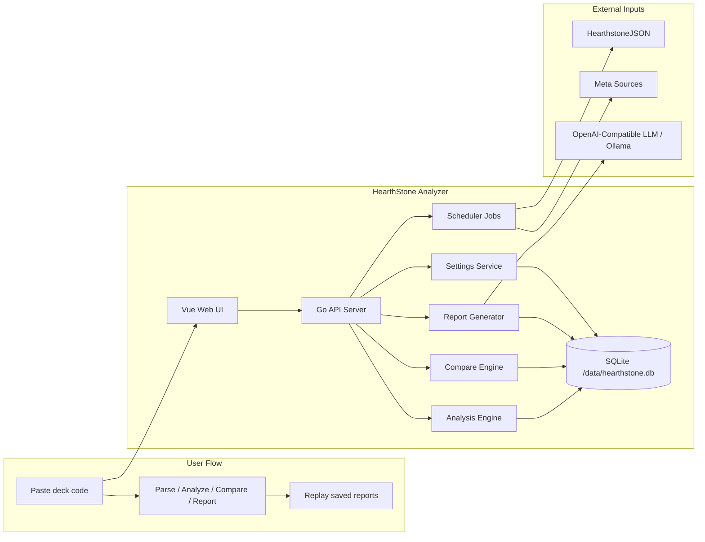
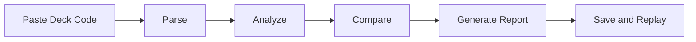

# HearthStone Analyzer


🌐 Language: **English** | [繁體中文](README.zh-TW.md)


> Analyze Hearthstone decks with deterministic insights, meta comparisons, and LLM reporting in one deployable app.

HearthStone Analyzer is a single-container Hearthstone deck analysis app.
It parses deck codes, runs rule-based analysis, compares your list against stored meta decks, and generates AI reports through an OpenAI-compatible endpoint such as local Ollama.

## 📌 Project Content
> Quick take: Use this mini table of contents to jump straight to the section you need.

| Build | Run | Operate |
| --- | --- | --- |
| [What It Is](#-what-it-is) | [Main Screens](#️-main-screens) | [Deployment](#-deployment) |
| [Core Features](#-core-features) | [Where To Get Deck Codes](#-where-to-get-deck-codes) | [Windows Docker + Local Ollama](#-windows-docker--local-ollama) |
| [Architecture](#-architecture) | [API Surface](#-api-surface) | [First-Start Smoke Test](#-first-start-smoke-test) |
| [Project Docs](#-project-docs) | [Local Development](#️-local-development) | [Validation Status](#-validation-status) |
| [Backup and Restore](#-backup-and-restore) | [Dev Container](#-dev-container) | [Known Limitations](#️-known-limitations) |

## ✨ What It Is
> Quick take: This project takes you from a raw deck code to structured analysis, meta comparison, and an AI-written report in one place.

- Parse Hearthstone deck codes into card lists with legality checks
- Run deterministic deck analysis with:
  - archetype classification
  - confidence reasons
  - structural tag explanations
  - package analysis
  - suggested adds and cuts
- Compare your deck against stored meta decks with:
  - ranked candidates
  - similarity breakdown
  - shared and missing card diff
  - merged guidance with source, support, and confidence
- Generate AI deck reports through an OpenAI-compatible chat API
- Store report history and reopen previous results
- Switch the UI between English and Traditional Chinese

## 🧱 Architecture
> Quick take: The system stays intentionally small and deployable, with one app, one database, and one container.



- Single Go application
- Vue frontend embedded into the Go binary
- SQLite storage
- In-process scheduler
- Single-container deployment target

There is no Redis, PostgreSQL, or multi-service orchestration requirement for the current product shape.

## 🖥️ Main Screens
> Quick take: The web UI covers the full working loop from input, to analysis, to compare, to saved reports.



- Deck input with `Parse`, `Analyze`, `Compare`, and `Generate Report`
- Analysis view with structural and package reads
- Compare view with candidate decks and merged guidance
- Report view with saved history replay
- Meta snapshot overview
- Jobs control panel
- Settings page for LLM configuration

## 🎯 Core Features
> Quick take: Most of the product value is already in place for local use and first deployment.

- Card sync from HearthstoneJSON into local SQLite
- Persisted card-level metadata and functional tags
- Hearthstone-specific package taxonomy
- Compare-aware merged guidance
- Local Ollama support through OpenAI-compatible APIs
- Saved report replay
- Bilingual UI shell

## 🃏 Where To Get Deck Codes
> Quick take: You can copy deck codes from popular Hearthstone sites and paste them directly into the app.

- [Hearthstone Top Decks](https://www.hearthstonetopdecks.com/)
- [Vicious Syndicate](https://www.vicioussyndicate.com/)
- [HSReplay](https://hsreplay.net/)

Look for buttons such as `Copy Deck Code` on those sites.

You can also use this sample deck code for quick testing:

```text
AAIB8eEEAA-zAY0Qt2ziygLP0QPboASFoQSC5ASL7AWi-gXHpAbd5QaKsQeEAZ4BAA
```

## 📚 Project Docs
> Quick take: These docs cover product scope, implementation state, deployment, and backup procedures.

- [Traditional Chinese README](README.zh-TW.md)
- [PRD_v2.md](PRD_v2.md)
- [IMPLEMENTATION_PLAN.md](IMPLEMENTATION_PLAN.md)
- [CURRENT_PROGRESS.md](CURRENT_PROGRESS.md)
- [DEPLOYMENT.md](DEPLOYMENT.md)
- [BACKUP_RESTORE.md](BACKUP_RESTORE.md)

## 🛠️ Local Development
> Quick take: The repo supports a straightforward Go backend workflow plus a separate Vue frontend build loop.

### Backend
> Quick take: The backend is a standard Go app with direct test and run commands.

Requirements:

- Go 1.21+

Commands:

```bash
go test ./...
go run ./cmd/api
go run ./cmd/sync_cards
```

Repo shortcuts:

```bash
make test
make build
make run
```

Defaults:

- HTTP address: `:8080`
- SQLite path: `data/hearthstone.db`

Useful environment variables:

- `APP_ADDR`
- `APP_DB_PATH`
- `APP_DATA_DIR`
- `APP_SETTINGS_KEY`
- `APP_CARDS_SOURCE_URL`
- `APP_CARDS_LOCALE`
- `APP_META_FILE`
- `APP_META_FIXTURE`
- `APP_META_REMOTE_URL`
- `APP_META_REMOTE_TOKEN`
- `APP_META_REMOTE_HEADER_NAME`
- `APP_META_REMOTE_HEADER_VALUE`
- `APP_META_REMOTE_PROFILE`

### Frontend
> Quick take: The frontend uses Vue + Vite and must be built before Go embed-based verification.

Commands:

```bash
cd web
npm install
npm test
npm run build
```

Repo shortcuts:

```bash
make frontend-install
make frontend-test
make frontend-build
make verify
```

Windows PowerShell note for this machine:

```powershell
$env:PATH='C:\Program Files\nodejs;' + $env:PATH
& 'C:\Program Files\nodejs\npm.cmd' test
& 'C:\Program Files\nodejs\npm.cmd' run build
```

### Build Order
> Quick take: Because the Go app embeds `web/dist`, frontend build output must exist before final Go verification.

The Go app embeds files from `web/dist` via `web/embed.go`.

Recommended verification order:

```bash
cd web
npm test
npm run build
cd ..
go test ./...
```

If `go test ./...` fails with `web\embed.go: pattern dist/*: no matching files found`, rebuild the frontend first.

## 🔌 API Surface
> Quick take: The API already covers settings, cards, decks, jobs, meta snapshots, and report generation.

- `GET /healthz`
- `GET /api/settings`
- `GET /api/settings/{key}`
- `PUT /api/settings/{key}`
- `GET /api/cards`
- `GET /api/cards/{id}`
- `POST /api/decks/parse`
- `POST /api/decks/analyze`
- `POST /api/decks/compare`
- `POST /api/reports/generate`
- `GET /api/reports`
- `GET /api/reports/{id}`
- `GET /api/jobs`
- `GET /api/jobs/{key}`
- `PUT /api/jobs/{key}`
- `POST /api/jobs/{key}/run`
- `GET /api/jobs/{key}/history`
- `GET /api/meta/latest`
- `GET /api/meta`
- `GET /api/meta/{id}`

## 🚀 Deployment
> Quick take: The app is designed for simple Docker deployment with a persistent `/data` mount.

For the full deployment guide, see [DEPLOYMENT.md](DEPLOYMENT.md).

### Deployment at a Glance
> Quick take: Build the image, mount `/data`, configure the LLM endpoint, then run a smoke test.

1. Build the Docker image
2. Start the container with a persistent `/data` mount
3. Set `APP_SETTINGS_KEY` to a raw 32-character string
4. Configure Ollama or another OpenAI-compatible endpoint in the UI
5. Run `sync_cards`, then test parse, analyze, compare, and report

### Docker Build
> Quick take: Build one image and use the same artifact for local testing or first deployment.

```bash
docker build -t hearthstone-analyzer:dev .
```

### Basic Docker Run
> Quick take: This is the fastest way to boot the app without persistence.

```bash
docker run --rm -p 8080:8080 hearthstone-analyzer:dev
```

### Recommended Persistent Run
> Quick take: Use a volume or bind mount so the SQLite database and saved settings survive restarts.

Named volume:

```bash
docker volume create hearthstone-data

docker run -d \
  --name hearthstone-analyzer \
  -p 8080:8080 \
  -e APP_SETTINGS_KEY=replace-with-32-char-secret \
  -v hearthstone-data:/data \
  hearthstone-analyzer:dev
```

Bind mount:

```bash
docker run -d \
  --name hearthstone-analyzer \
  -p 8080:8080 \
  -e APP_SETTINGS_KEY=replace-with-32-char-secret \
  -v /absolute/host/path:/data \
  hearthstone-analyzer:dev
```

### `APP_SETTINGS_KEY`
> Quick take: This key must be a raw 32-character string or encrypted settings will break.

- Use a raw 32-character string
- Do not use a 64-character hex string from `openssl rand -hex 32`

Example valid key:

```text
m7Kp2Qx9Lr4Vz8Nc1Tw6By3Hs5Df0GaJ
```

## 🪟 Windows Docker + Local Ollama
> Quick take: This exact path has already been validated locally on Windows.

### Start the Container
> Quick take: Build the image, mount a local data folder, and expose port `8080`.

```powershell
cd D:\HearthStone
docker build -t hearthstone-analyzer:dev .

docker run -d `
  --name hearthstone-analyzer `
  -p 8080:8080 `
  -e APP_SETTINGS_KEY=m7Kp2Qx9Lr4Vz8Nc1Tw6By3Hs5Df0GaJ `
  -v D:\HearthStone\data:/data `
  hearthstone-analyzer:dev
```

### Configure Ollama in the UI
> Quick take: Point the app at the host machine through `host.docker.internal`, not `localhost`.

Open `http://localhost:8080` and set:

- `llm.base_url = http://host.docker.internal:11434/v1`
- `llm.api_key = ollama`
- `llm.model = <your-local-model>`

Example local model:

- `qwen3.5:2b`

Why `host.docker.internal`:

- Inside Docker, `localhost` points at the container
- `host.docker.internal` points back to the Windows host running Ollama

### Validate Ollama
> Quick take: Confirm the local model responds, then run the app's full parse-to-report flow.

Host-side quick check:

```powershell
Invoke-RestMethod http://localhost:11434/v1/models
```

Then in the app:

1. Run `sync_cards`
2. Paste a deck code
3. Click `Parse`
4. Click `Analyze`
5. Click `Generate Report`

## ✅ First-Start Smoke Test
> Quick take: These checks confirm the deployed app is healthy end to end.

1. `GET /healthz` returns `ok`
2. The UI loads
3. Settings can be saved
4. `sync_cards` succeeds
5. Parse works
6. Analyze works
7. Compare works if meta is available
8. Report generation works
9. Recent report replay works
10. UI language switch persists after refresh

## 🧪 Validation Status
> Quick take: Backend tests, frontend tests, Docker startup, and local Ollama reporting have all been exercised.

Last confirmed verification:

- `go test ./...`
- `web`:
  - `npm test`
  - `npm run build`
- Windows Docker local deployment
- Local Ollama report generation

## ⚠️ Known Limitations
> Quick take: The first release is functional, but some localization and long-tail data polish still remain.

- Some analyze and report wording is still partly English depending on content source
- Remote meta card-name normalization still has edge cases
- Frontend automated coverage is still fairly light
- Scheduler logging and retention are still basic

## 💾 Backup and Restore
> Quick take: Back up the SQLite file before upgrades so settings, reports, and synced data are safe.

See [BACKUP_RESTORE.md](BACKUP_RESTORE.md).

At minimum, back up:

- `/data/hearthstone.db` inside the container
- Or your host-mounted `data` directory if using a bind mount

## 🧰 Dev Container
> Quick take: A dev container is included if you want a more repeatable local toolchain.

The repository includes a Dev Container with:

- Go
- Node.js
- Common build tooling

Use it if you want a consistent local environment for backend and frontend work.
