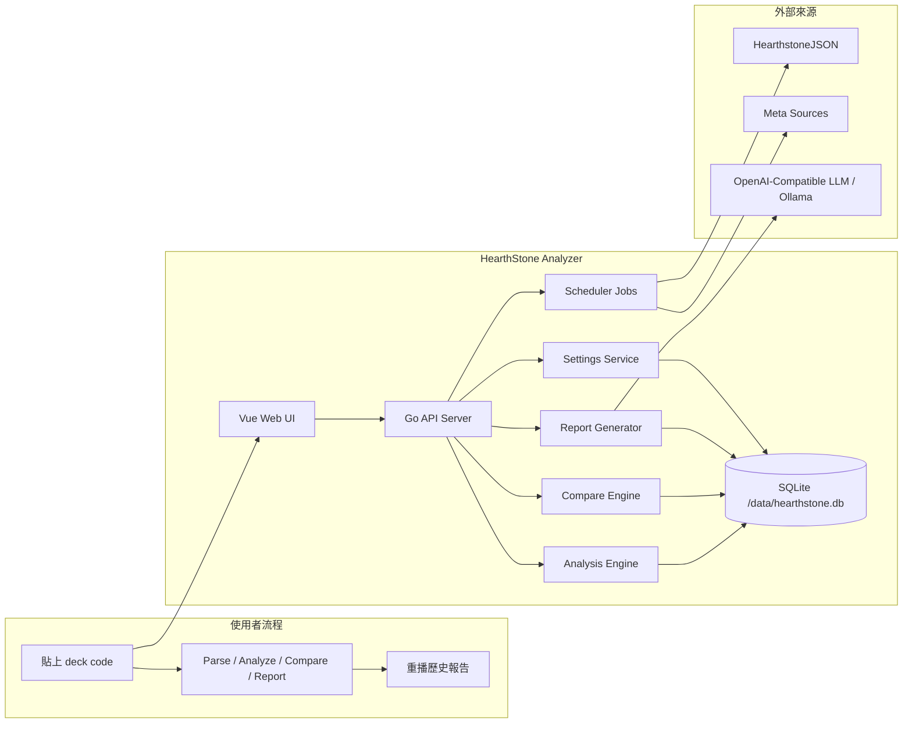
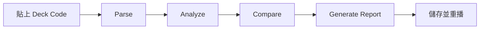

# HearthStone Analyzer


🌐 語言：**繁體中文** | [English](README.md)


> 用可部署的單一工具，把 Hearthstone 牌組解析、規則分析、meta 比對與 LLM 報告整合在一起。

`HearthStone Analyzer` 是一個以單容器部署為目標的 Hearthstone 牌組分析工具。
它可以解析 deck code、做規則式分析、比對已儲存的 meta 牌組，並透過 OpenAI-compatible API 生成 AI 報告，例如本機 Ollama。

## 📌 章節導覽
> 快速理解：這個目錄可以讓你快速跳到需要的章節。

| 建置 | 使用 | 維運 |
| --- | --- | --- |
| [專案是做什麼的](#-專案是做什麼的) | [主要畫面](#️-主要畫面) | [部署方式](#-部署方式) |
| [目前核心能力](#-目前核心能力) | [Deck Code 從哪裡來](#-deck-code-從哪裡來) | [Windows Docker + 本機 Ollama](#-windows-docker--本機-ollama) |
| [架構](#-架構) | [API 概覽](#-api-概覽) | [首次啟動 Smoke Test](#-首次啟動-smoke-test) |
| [重要文件](#-重要文件) | [本地開發](#️-本地開發) | [驗證狀態](#-驗證狀態) |
| [備份與還原](#-備份與還原) | [Dev Container](#-dev-container) | [已知限制](#️-已知限制) |

## ✨ 專案是做什麼的
> 快速理解：這個專案把 deck code、規則分析、meta 比對與 AI 報告整合在同一個工具裡。

- 解析 Hearthstone deck code，並做合法性檢查
- 執行 deterministic 牌組分析：
  - archetype 判讀
  - confidence reasons
  - structural tag explanations
  - package analysis
  - suggested adds / cuts
- 與已儲存的 meta 牌組比對：
  - 候選牌組排序
  - similarity breakdown
  - shared / missing cards diff
  - merged guidance，包含 source / support / confidence
- 透過 OpenAI-compatible chat API 生成 AI 牌組報告
- 儲存報告並可重新開啟歷史結果
- UI 可一鍵切換英文與繁中

## 🧱 架構
> 快速理解：系統刻意維持精簡，用單一應用程式和 SQLite 就能完成部署。



- 單一 Go 應用程式
- Vue 前端編譯後嵌入 Go binary
- SQLite 單機儲存
- in-process scheduler
- 單容器部署

目前不需要 Redis、PostgreSQL，或多服務編排。

## 🖥️ 主要畫面
> 快速理解：目前 UI 已經涵蓋從輸入牌組到生成報告的完整流程。



- Deck input 與 `Parse`、`Analyze`、`Compare`、`Generate Report`
- Analysis 視圖，顯示 structural 與 package 分析
- Compare 視圖，顯示 candidate decks 與 merged guidance
- Report 視圖，可重播歷史報告
- Meta snapshot 概覽
- Jobs 控制頁
- Settings 頁面，用來設定 LLM

## 🎯 目前核心能力
> 快速理解：第一版產品主線已經收口，足以支撐本地使用與初版部署。

- 從 HearthstoneJSON 同步卡牌到本地 SQLite
- 持久化 card metadata 與 functional tags
- 更細的 Hearthstone-specific package taxonomy
- compare-aware merged guidance
- 支援本機 Ollama 的 OpenAI-compatible 接法
- 儲存並重播報告
- 中英文 UI 切換

## 🃏 Deck Code 從哪裡來
> 快速理解：你可以直接從主流 Hearthstone 網站複製 deck code 貼進本工具。

- [Hearthstone Top Decks](https://www.hearthstonetopdecks.com/)
- [Vicious Syndicate](https://www.vicioussyndicate.com/)
- [HSReplay](https://hsreplay.net/)

通常頁面上會有 `Copy Deck Code` 按鈕。

你也可以直接用這組測試：

```text
AAIB8eEEAA-zAY0Qt2ziygLP0QPboASFoQSC5ASL7AWi-gXHpAbd5QaKsQeEAZ4BAA
```

## 📚 重要文件
> 快速理解：這些文件分別對應產品規格、進度、部署與備份還原。

- [English README](README.md)
- [PRD_v2.md](PRD_v2.md)
- [IMPLEMENTATION_PLAN.md](IMPLEMENTATION_PLAN.md)
- [CURRENT_PROGRESS.md](CURRENT_PROGRESS.md)
- [DEPLOYMENT.md](DEPLOYMENT.md)
- [BACKUP_RESTORE.md](BACKUP_RESTORE.md)

## 🛠️ 本地開發
> 快速理解：本地開發分成 Go backend 與 Vue frontend 兩條主要工作流。

### Backend
> 快速理解：backend 是標準 Go 專案，測試與啟動流程都很直接。

需求：

- Go 1.21+

常用指令：

```bash
go test ./...
go run ./cmd/api
go run ./cmd/sync_cards
```

Repo shortcuts：

```bash
make test
make build
make run
```

預設值：

- HTTP 位址：`:8080`
- SQLite 路徑：`data/hearthstone.db`

常用環境變數：

- `APP_ADDR`
- `APP_DB_PATH`
- `APP_DATA_DIR`
- `APP_SETTINGS_KEY`
- `APP_CARDS_SOURCE_URL`
- `APP_CARDS_LOCALE`
- `APP_META_FILE`
- `APP_META_FIXTURE`
- `APP_META_REMOTE_URL`
- `APP_META_REMOTE_TOKEN`
- `APP_META_REMOTE_HEADER_NAME`
- `APP_META_REMOTE_HEADER_VALUE`
- `APP_META_REMOTE_PROFILE`

### Frontend
> 快速理解：frontend 用 Vue + Vite，並且需要先 build 出 `web/dist` 給 Go embed 使用。

常用指令：

```bash
cd web
npm install
npm test
npm run build
```

Repo shortcuts：

```bash
make frontend-install
make frontend-test
make frontend-build
make verify
```

Windows PowerShell 補充：

```powershell
$env:PATH='C:\Program Files\nodejs;' + $env:PATH
& 'C:\Program Files\nodejs\npm.cmd' test
& 'C:\Program Files\nodejs\npm.cmd' run build
```

### Build 順序
> 快速理解：因為 Go 會 embed `web/dist`，所以前端 build 必須先完成。

Go 透過 `web/embed.go` 內嵌 `web/dist`。

建議驗證順序：

```bash
cd web
npm test
npm run build
cd ..
go test ./...
```

如果 `go test ./...` 出現 `web\embed.go: pattern dist/*: no matching files found`，先重新 build frontend。

## 🔌 API 概覽
> 快速理解：目前 API 已經涵蓋 settings、cards、decks、jobs、meta 與 reports。

- `GET /healthz`
- `GET /api/settings`
- `GET /api/settings/{key}`
- `PUT /api/settings/{key}`
- `GET /api/cards`
- `GET /api/cards/{id}`
- `POST /api/decks/parse`
- `POST /api/decks/analyze`
- `POST /api/decks/compare`
- `POST /api/reports/generate`
- `GET /api/reports`
- `GET /api/reports/{id}`
- `GET /api/jobs`
- `GET /api/jobs/{key}`
- `PUT /api/jobs/{key}`
- `POST /api/jobs/{key}/run`
- `GET /api/jobs/{key}/history`
- `GET /api/meta/latest`
- `GET /api/meta`
- `GET /api/meta/{id}`

## 🚀 部署方式
> 快速理解：部署主線就是 build image，然後把 `/data` 做持久化。

完整部署說明請看 [DEPLOYMENT.md](DEPLOYMENT.md)。

### 部署快速版
> 快速理解：先 build image、掛資料目錄、設定 LLM，再跑一輪 smoke test。

1. 建立 Docker image
2. 用持久化 `/data` 啟動容器
3. 把 `APP_SETTINGS_KEY` 設成原始 32 字元字串
4. 在 UI 內配置 Ollama 或其他 OpenAI-compatible endpoint
5. 跑 `sync_cards`，再測 parse、analyze、compare、report

### Docker Build
> 快速理解：先 build 出同一個 image，後面本地測試和正式部署都能共用。

```bash
docker build -t hearthstone-analyzer:dev .
```

### 基本 Docker 啟動
> 快速理解：這個方式適合快速試跑，但不會保留資料。

```bash
docker run --rm -p 8080:8080 hearthstone-analyzer:dev
```

啟用遠端 meta sync 的基本啟動方式：

```bash
docker run --rm \
  -p 8080:8080 \
  -e APP_META_REMOTE_PROFILE=vicioussyndicate \
  -e APP_META_REMOTE_URL=https://www.vicioussyndicate.com/tag/meta/ \
  hearthstone-analyzer:dev
```

### 建議的持久化啟動方式
> 快速理解：正式使用時，請掛 volume 或 bind mount 保留 SQLite 與設定資料。

Named volume：

```bash
docker volume create hearthstone-data

docker run -d \
  --name hearthstone-analyzer \
  -p 8080:8080 \
  -e APP_SETTINGS_KEY=replace-with-32-char-secret \
  -v hearthstone-data:/data \
  hearthstone-analyzer:dev
```

Bind mount：

```bash
docker run -d \
  --name hearthstone-analyzer \
  -p 8080:8080 \
  -e APP_SETTINGS_KEY=replace-with-32-char-secret \
  -v /absolute/host/path:/data \
  hearthstone-analyzer:dev
```

啟用遠端 meta sync 的 named volume 啟動方式：

```bash
docker volume create hearthstone-data

docker run -d \
  --name hearthstone-analyzer \
  -p 8080:8080 \
  -e APP_SETTINGS_KEY=replace-with-32-char-secret \
  -e APP_META_REMOTE_PROFILE=vicioussyndicate \
  -e APP_META_REMOTE_URL=https://www.vicioussyndicate.com/tag/meta/ \
  -v hearthstone-data:/data \
  hearthstone-analyzer:dev
```

啟用遠端 meta sync 的 bind mount 啟動方式：

```bash
docker run -d \
  --name hearthstone-analyzer \
  -p 8080:8080 \
  -e APP_SETTINGS_KEY=replace-with-32-char-secret \
  -e APP_META_REMOTE_PROFILE=vicioussyndicate \
  -e APP_META_REMOTE_URL=https://www.vicioussyndicate.com/tag/meta/ \
  -v /absolute/host/path:/data \
  hearthstone-analyzer:dev
```

### `APP_SETTINGS_KEY` 注意事項
> 快速理解：這個值一定要是原始 32 字元字串，否則加密設定會失效。

- 必須是原始 32 字元字串
- 不要使用 `openssl rand -hex 32` 產生的 64 字元 hex

範例：

```text
m7Kp2Qx9Lr4Vz8Nc1Tw6By3Hs5Df0GaJ
```

## 🪟 Windows Docker + 本機 Ollama
> 快速理解：這條路徑已經在本機 Windows 上完成實測並可正常生成報告。

### 啟動容器
> 快速理解：build image、掛資料目錄、開放 `8080` 後就能直接進 UI。

```powershell
cd D:\HearthStone
docker build -t hearthstone-analyzer:dev .

docker run -d `
  --name hearthstone-analyzer `
  -p 8080:8080 `
  -e APP_SETTINGS_KEY=m7Kp2Qx9Lr4Vz8Nc1Tw6By3Hs5Df0GaJ `
  -v D:\HearthStone\data:/data `
  hearthstone-analyzer:dev
```

同時啟用本機 Ollama 與遠端 meta sync 的啟動方式：

```powershell
cd D:\HearthStone
docker build -t hearthstone-analyzer:dev .

docker run -d `
  --name hearthstone-analyzer `
  -p 8080:8080 `
  -e APP_SETTINGS_KEY=m7Kp2Qx9Lr4Vz8Nc1Tw6By3Hs5Df0GaJ `
  -e APP_META_REMOTE_PROFILE=vicioussyndicate `
  -e APP_META_REMOTE_URL=https://www.vicioussyndicate.com/tag/meta/ `
  -v D:\HearthStone\data:/data `
  hearthstone-analyzer:dev
```

### UI 內設定 Ollama
> 快速理解：容器要連回 Windows 主機上的 Ollama，所以 base URL 不能填 `localhost`。

- `llm.base_url = http://host.docker.internal:11434/v1`
- `llm.api_key = ollama`
- `llm.model = <你的本機模型名稱>`

例如：

- `qwen3.5:2b`

為什麼是 `host.docker.internal`：

- Docker 內的 `localhost` 指向容器自己
- `host.docker.internal` 才會回到 Windows 主機上的 Ollama

### Ollama 快速驗證
> 快速理解：先確定模型存在，再從 UI 跑完整 parse 到 report 流程。

```powershell
Invoke-RestMethod http://localhost:11434/v1/models
```

然後在 UI：

1. 跑 `sync_cards`
2. 貼上 deck code
3. 按 `Parse`
4. 按 `Analyze`
5. 按 `Generate Report`

## OpenRouter 範例
> 快速理解：目前這套 OpenAI-compatible provider 路徑可直接接 OpenRouter，包括提供 chat completions API 的 free model。

### UI 內設定 OpenRouter
> 快速理解：base URL 要填到 OpenRouter 的 `/api/v1`，因為程式會自動再補上 `/chat/completions`。

開啟 `http://localhost:8080` 後設定：

- `llm.base_url = https://openrouter.ai/api/v1`
- `llm.api_key = <你的 OpenRouter API key>`
- `llm.model = qwen/qwen3.6-plus:free`

注意事項：

- `base_url` 要停在 `/api/v1`，不要只填 `https://openrouter.ai`
- 即使是 `:free` model，OpenRouter 仍然需要 API key
- 不需要修改程式碼，因為目前已經是 OpenAI-compatible chat completions client

### OpenRouter 快速驗證
> 快速理解：先確認 API key 能打到指定模型，再到 UI 跑同一套 parse 到 report 流程。

PowerShell 快速測試：

```powershell
$headers = @{
  Authorization = "Bearer <你的 OpenRouter API key>"
  "Content-Type" = "application/json"
}

$body = @{
  model = "qwen/qwen3.6-plus:free"
  messages = @(
    @{
      role = "user"
      content = "Reply with the single word ok."
    }
  )
} | ConvertTo-Json -Depth 5

Invoke-RestMethod `
  -Method Post `
  -Uri https://openrouter.ai/api/v1/chat/completions `
  -Headers $headers `
  -Body $body
```

然後在 UI：

1. 跑 `sync_cards`
2. 貼上 deck code
3. 按 `Parse`
4. 按 `Analyze`
5. 按 `Generate Report`

## ✅ 首次啟動 Smoke Test
> 快速理解：這份 checklist 能快速確認部署後的核心能力都有正常運作。

1. `GET /healthz` 回 `ok`
2. UI 可正常載入
3. settings 可儲存
4. `sync_cards` 成功
5. parse 成功
6. analyze 成功
7. compare 在有 meta 時可成功
8. report 成功
9. Recent Reports 可重新開啟
10. 中英切換後 refresh 仍保留語系

## 🧪 驗證狀態
> 快速理解：目前 backend、frontend、Docker 啟動與本機 Ollama 路徑都已驗過。

最近已確認通過：

- `go test ./...`
- `web`：
  - `npm test`
  - `npm run build`
- Windows Docker 本地部署
- 本機 Ollama 報告生成

## ⚠️ 已知限制
> 快速理解：第一版已可用，但在中文化與少數資料邊角情況上還有優化空間。

- `Analyze` 與 `Report` 仍有部分內容可能殘留英文
- remote meta 的 card-name normalization 還有邊角 case
- frontend 自動測試覆蓋率仍偏少
- scheduler logging 與 retention 仍較基礎

## 💾 備份與還原
> 快速理解：升級前先備份 SQLite，能保住設定、同步資料與報告歷史。

請參考 [BACKUP_RESTORE.md](BACKUP_RESTORE.md)。

至少要備份：

- 容器內的 `/data/hearthstone.db`
- 或 bind mount 到主機上的 `data` 目錄

## 🧰 Dev Container
> 快速理解：如果你想讓開發環境更一致，repo 內已經附好 Dev Container。

這個 repo 內建 Dev Container，包含：

- Go
- Node.js
- 常用 build tooling

如果你想讓 backend 與 frontend 的本地環境更一致，可以直接使用它。
